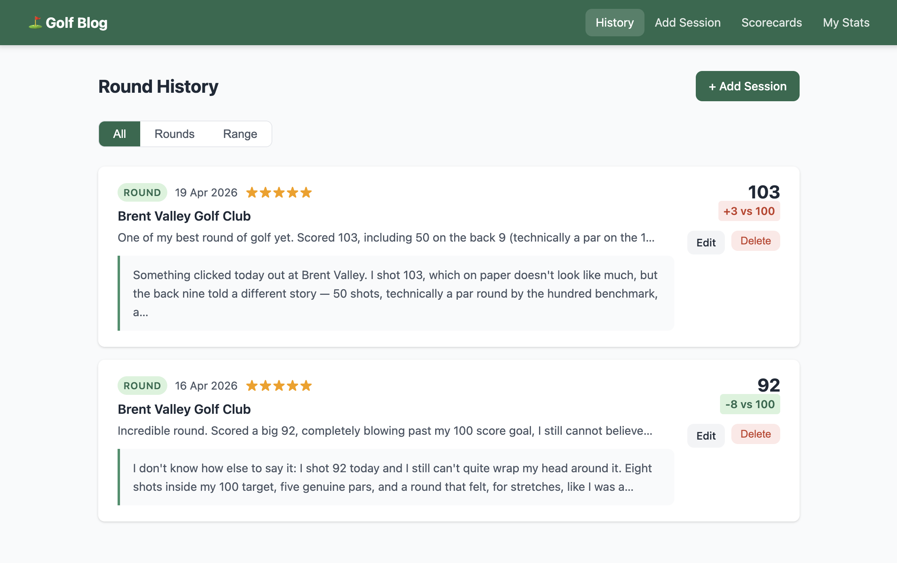

# Golf Blog

A personal golf round tracker and blog. Log rounds and practice sessions, track progress over time, and get AI-generated coaching summaries powered by Claude.

> 🤖 This app was built 100% with [Claude Code](https://claude.ai/code).



## Features

- **Log rounds and range sessions** — date, venue, score, rating, notes
- **Hole-by-hole scoring** — optional per-hole entry when a venue scorecard is loaded
- **Session detail view** — click any history card to see the full session: complete notes, full AI blog entry, and a hole-by-hole score table with par, S.I., and per-hole +/− diff
- **AI blog entries** — Claude ghostwrites a first-person blog entry for each session, bringing the round to life in your voice
- **Score tracking** — vs par (when available) or vs 100 as a default handicap baseline
- **Progress chart** — score over time, switchable between raw score / vs par / vs 100
- **My Stats** — rounds played, best score, average score, average vs par, scoring trend
- **Markdown storage** — every session and scorecard is saved as a human-readable `.md` file alongside the database

## Stack

- **Backend** — Node.js + Express
- **Database** — SQLite via better-sqlite3
- **AI** — Anthropic Claude (`claude-sonnet-4-6`) via `@anthropic-ai/sdk`
- **Frontend** — Vanilla JS, Chart.js

## Requirements

- Node.js 18+
- `ANTHROPIC_API_KEY` set in your shell environment

## Setup

```bash
npm install
npm run dev
```

Open [http://localhost:3000](http://localhost:3000).

## Usage

### Adding a scorecard

Go to **Scorecards** and add a venue with its yellow tee hole data (yards, par, S.I.). The scorecard is saved as `scorecards/<venue-slug>.md`.

You can also drop a markdown file directly into the `scorecards/` directory — it will be imported into the app automatically on the next startup.

### Logging a session

Go to **Add Session**. Select a venue if you have a scorecard loaded — this unlocks optional hole-by-hole score entry and auto-fills course par. Without a scorecard, scores are tracked vs 100.

Each session is saved as `rounds/YYYY-MM-DD_<venue>.md` with front-matter, your notes, the AI summary, and a full hole breakdown.

### Viewing a session

Click any history card to open the full session detail: your complete notes, the AI-written blog entry, and a hole-by-hole breakdown comparing your scores to par.

### Editing or deleting

Use the **Edit** / **Delete** buttons on any history card or session detail page. Editing a session regenerates the AI summary and rewrites the markdown file.

## File structure

```
├── server.js
├── db/
│   ├── schema.sql
│   └── database.js
├── routes/
│   ├── sessions.js
│   ├── scorecards.js
│   └── stats.js
├── services/
│   ├── claudeService.js     # AI summary generation
│   ├── markdownService.js   # Read/write .md files
│   ├── statsService.js      # Score calculations
│   └── syncService.js       # Import scorecards from markdown on startup
├── rounds/                  # One .md file per session (auto-created)
├── scorecards/              # One .md file per venue
└── public/                  # Frontend (HTML + vanilla JS + CSS)
```
